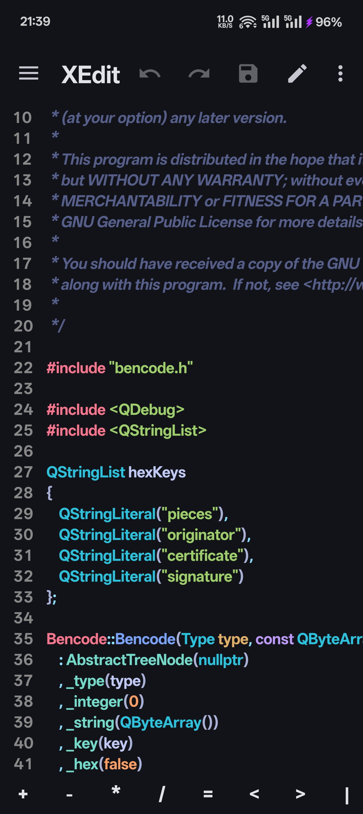
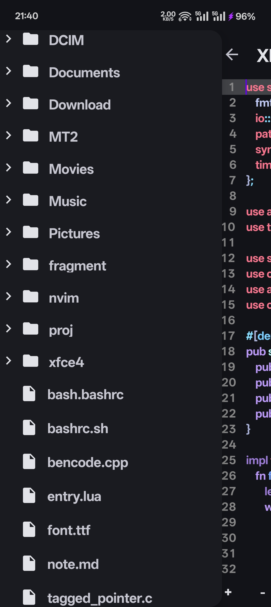

# xedit-app

Android Code Editor

Currently a lot of features work in progress, 
don't report too many issues, 
git history will not be saved until the features are stable, 
but you can still submit pull request

    

    

