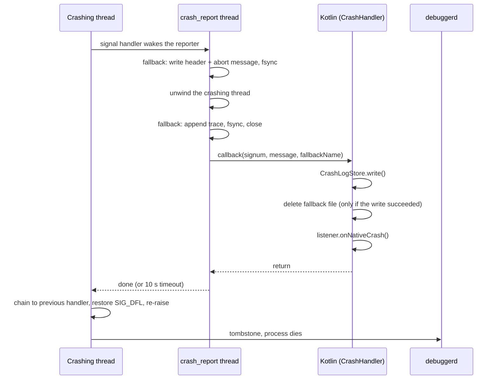

# Crash Capture Module

Captures Java crashes, native crashes and ANRs in-process, saves every crash to
disk before anything else happens, and shows all unseen crashes to the user in
a dedicated `CrashActivity`, from which they can be copied, exported or
uploaded.

The module is designed to coexist with the platform rather than replace it:

- **Java crashes** are recorded, then handed to the previous default handler
  (normally the system's), which reports them to ActivityManager and kills the
  process. Android vitals, `ApplicationExitInfo` and other crash SDKs see them
  as usual.
- **Native crashes** are recorded, then the signal is passed on so `debuggerd`
  still writes a tombstone.
- **ANRs** are detected through SIGQUIT, which is always forwarded to ART's
  Signal Catcher, so the system's `traces.txt` is unaffected.

## Contents

1. [Architecture](#architecture)
2. [Capture paths](#capture-paths)
3. [Log storage](#log-storage)
4. [Uploading](#uploading)
5. [Integration](#integration)
6. [Usage](#usage)
7. [Testing](#testing)
8. [Known limitations](#known-limitations)

---

## Architecture

### Processes

| Process | Role |
|---|---|
| Main process | Installs crash capture, writes crash logs, runs upload work |
| `:crash` | Runs `CrashActivity` only. Crash capture is **never** installed here |

`CrashActivity` lives in its own process so it can still be shown while the
main process is stuck (ANR) or dying (native crash).

### Source files

| File | Responsibility |
|---|---|
| `CrashHandler.kt` | Public entry point: `install()` / `uninstall()`, Java uncaught handler, JNI callbacks for native crashes and ANRs, debug-only test APIs |
| `CrashLogStore.kt` | The only owner of crash logs: writing, deduplication, pruning, adopting native fallback reports, `consumeAll()` |
| `CrashReportUploader.kt` | Queues reports for upload with WorkManager; `CrashReportWorker` posts them |
| `CrashActivity.kt` | Shows every unseen crash; report, copy, export, restart, close |
| `MyApplication.kt` | Example host: installs capture, opens `CrashActivity`, initializes WorkManager in `:crash` |
| `crash_handler.cpp` | Signal handlers, the crash reporter thread, the SIGQUIT (ANR) monitor |
| `fallback_report.cpp/.h` | Native write-ahead copy of a native crash report |

All crash types end up in **one** place, `CrashLogStore`, in **one** format.
Everything downstream (deduplication, `CrashActivity`, upload) only ever deals
with that format.

---

## Capture paths

### Java crashes

```
uncaught exception (any thread, main thread included)
  └─ JavaCrashHandler.uncaughtException()
       ├─ CrashLogStore.write()                 log is on disk
       ├─ listener.onJavaCrash()                first crash of the process only
       └─ previous handler (finally)            ALWAYS, even if the above threw
            └─ system: ActivityManager.handleApplicationCrash(), then kill
```

- The main `Looper` is **not** wrapped. A main-thread exception propagates out
  of `Looper.loop()` in `ActivityThread.main()`, and the runtime dispatches it
  to the default handler like any other thread's. A crash is never swallowed
  to keep the app running.
- If several threads crash at nearly the same time, every crash is saved, but
  only the first one reaches the listener. `CrashActivity` reads all saved
  logs anyway.
- `onJavaCrash` must **not** exit the process and should return quickly. The
  system kills the process right after.
- If no previous handler exists (unusual), the process is killed directly.

**Expected exceptions belong at their source.** An invalid regular expression
typed by the user, a malformed file, an I/O error: catch these where they
happen and show a precise error. Anything that reaches the uncaught handler
ends the process.

### Native crashes



- The signal handler runs on an alternate signal stack and only wakes the
  reporter thread. Only one thread reports per process; the crashing thread
  waits up to 10 seconds for the report, then lets the signal continue.
- The native **fallback report** is written before any JVM work, so a crash is
  not lost if the JNI callback cannot complete (ART deadlocked, attach failed,
  process killed mid-report). See [Log storage](#log-storage).
- `onNativeCrash` runs on the `crash_report` thread. It must **not** exit the
  process: after it returns, the signal reaches `debuggerd`, which writes a
  tombstone, and the process dies on its own.
- Native signal handlers become active when the native library loads (first
  access to `CrashHandler`). `install()` connects them to the listener.

### ANRs

When `install(anrMonitor = true)`, the native layer watches SIGQUIT, which the
system sends to a process it is about to declare unresponsive.

1. SIGQUIT arrives. `onAnrSignal()` snapshots the main thread's stack at once,
   since a background ANR may be killed right after the system's dump.
2. SIGQUIT is forwarded to ART's Signal Catcher, so the system trace dump
   happens as usual.
3. `onAnrConfirm()` checks, for up to 5 seconds, whether this is really an ANR
   of this process: the main thread must stay unresponsive, and
   `ActivityManager.getProcessesInErrorState()` must report this process as
   `NOT_RESPONDING`. A main thread that answers (another app's ANR,
   `adb shell kill -3`, a recovered stall) cancels the report.
4. Once confirmed: `CrashLogStore.write()`, then `listener.onAnrCrash()`.

`onAnrCrash` runs on the native `anr_report` thread while the main thread is
stuck: do not touch the UI or wait for the main thread there. By default it
forwards to `onJavaCrash`. The library never kills the process on an ANR; the
example `MyApplication` chooses to (see [Usage](#usage)).

---

## Log storage

### Directories

| Directory | Files | Role | Written by | Deleted by |
|---|---|---|---|---|
| `filesDir/native_crash/` | `native_<epoch_ms>_<pid>.log` | Native write-ahead copy | native reporter thread | Kotlin, once its own log is saved; or adopted on the next launch |
| `filesDir/logs/` | `crash_<yyyyMMdd>_<HHmmss>_<SSS>_<seq>_<type>_<signature>_<count>.log` | **The** crash log | `CrashLogStore.write()` | dedup replacement, startup pruning, `consumeAll()` |
| `noBackupFilesDir/crash_reports/` | `report_<ms>_<uuid>.txt` | Upload queue entry | `CrashReportUploader.enqueue()` | `CrashReportWorker` |

Only `crash_*` files are listed or deleted in `filesDir/logs/`, so the
directory can be shared with the app's other logs.

### Log format

```
Type: Java Crash
Time: 2026-10-08 14:03:21.457
Occurrences: 3 (only the latest is kept)     <- only when count > 1
Thread: main                                 <- when known
Process: x.editor.app (pid 12345)
App: x.editor.app 1.2.0 (120)
Device: Google Pixel 8
Android: 15 (API 35)
ABIs: arm64-v8a, armeabi-v7a, armeabi
------------------------------------------
java.lang.RuntimeException: ...
    at ...
```

### Saving

Every crash is persisted **before** the listener runs, so it survives a
listener that fails, an activity start that is blocked, or a process that dies.

- Content is written to a `.tmp` file and then renamed to `.log`, so a reader
  never sees a half-written log.
- Only after the rename succeeds are older logs of the same crash deleted.
- `write()` never throws. If saving fails (disk full), the returned
  `CrashLog.file` is `null` and `CrashLog.content` still carries the text,
  which `MyApplication` then passes to `CrashActivity` inline.

Native crashes add a write-ahead step:

1. The reporter writes the fallback file's header (signal, pid, tid, thread
   name, abort message) and `fsync`s it, without using the heap.
2. After unwinding, it appends the trace, `fsync`s again and closes the file.
3. Kotlin saves its own log with `CrashLogStore.write()`.
4. **Only if that succeeded**, Kotlin deletes the fallback file, and does so
   **before** calling the listener. A listener that throws or hangs therefore
   cannot leave a duplicate behind, and a failed write keeps the fallback so
   the crash is not lost.

### Deleting

**Crash logs (`crash_*.log`)**

- **Dedup replacement**: when the same crash happens again, the new log
  replaces the old one and the count in its name goes up. Only the newest copy
  of each distinct crash is kept.
- **Startup pruning** (`CrashLogStore.init()`): removes `.tmp` leftovers older
  than 60 seconds and keeps at most the 20 newest distinct crashes.
- **Seen means deleted** (`consumeAll()`): `CrashActivity` reads every log and
  deletes each one as it reads it, unreadable ones included, so a corrupt file
  cannot reappear forever. From then on the text lives only in the
  `ViewModel`: it survives rotation, but not the `:crash` process ending.
  Exporting is how the user keeps a copy.

**Native fallback reports (`native_*.log`)**

- **Normal case**: deleted by Kotlin during the same crash (step 4 above).
- **Left behind**: on the next launch, `install()` calls
  `CrashLogStore.adoptNativeFallbacks()` before re-enabling the fallback. Each
  file is converted into a regular crash log, using the original crash time
  and a signature computed exactly like the live path, so it deduplicates
  against normal logs of the same bug. Converted files are deleted. Blank
  files are deleted. Files that fail to convert are kept and retried on the
  next launch. Files whose writer process is still alive and that are younger
  than 60 seconds are skipped.

**Upload queue entries (`report_*.txt`)**

- Deleted by the worker after a successful upload, a non-retryable rejection,
  or the last failed attempt.
- Entries older than 7 days are removed the next time `enqueue()` runs.

### Deduplication signature

Two crashes are "the same" when their signatures match. Messages, addresses and
ids are left out on purpose, since they differ between occurrences of one bug.

| Type | Signature |
|---|---|
| Java | Exception class plus top 10 frames, for up to 5 throwables in the cause chain |
| ANR | Top 20 frames of the main thread |
| Native | Signal number plus the reporter's message, with hex addresses, pid/tid and the randomized `/data/app/...` install path normalized |

The type is part of the hash, and the result is 12 hex characters of SHA-1.

### Typical scenarios

**Foreground crash, everything works.** The log is saved (for a native crash,
the fallback is written and then deleted), and `CrashActivity` opens, reads the
log and deletes it. Nothing is left on disk unless the user submitted a
report, which stays in the upload queue until it is sent.

**Native crash, JNI callback fails.** Only the fallback file remains. On the
next launch, `install()` in `attachBaseContext` adopts it as a regular log.
When the first activity is created, `hasLogs()` is true, so `CrashActivity`
opens in "previous launch" mode on top of the app. Adoption runs before any
activity, so the adopted log is always found.

**Background crash.** The log is saved, but Android 10+ blocks starting an
activity from the background. The log stays on disk until the user opens the
app again, then follows the previous scenario.

---

## Uploading

`CrashReportUploader.enqueue(context, url, content)` queues a report with
WorkManager, so an upload survives the user leaving the screen, the process
being killed, and the device being offline.

- The content is staged as a file (WorkManager input data is limited to
  10 KB); only its path is passed to the worker.
- `enqueue()` blocks until WorkManager has persisted the work, so the caller
  may end its process right after. Call it off the main thread.
- The worker sends an HTTP `POST` with a `text/plain; charset=utf-8` body. It
  needs a network connection and retries with exponential backoff starting at
  30 seconds.
- Retried: I/O errors, HTTP 408, 429 and 5xx, up to 5 attempts in total.
  Other 4xx responses are not retried.
- `:crash` only records the work. It is **executed** in the main process,
  which the system job scheduler starts if needed.

---

## Integration

### Gradle

The module builds its native library with CMake. The app module needs
WorkManager:

```groovy
dependencies {
    implementation project(':crash')                              // module name: adjust
    implementation "androidx.work:work-runtime-ktx:<version>"
}
```

### Manifest

```xml
<uses-permission android:name="android.permission.INTERNET" />

<!-- Export on Android 9 and below only -->
<uses-permission
    android:name="android.permission.WRITE_EXTERNAL_STORAGE"
    android:maxSdkVersion="28" />

<application android:name=".MyApplication" ...>

    <activity
        android:name=".activity.CrashActivity"
        android:process=":crash"
        android:exported="false"
        android:excludeFromRecents="true">
        <intent-filter>
            <!-- Must equal Constants.ACTION_CRASH_REPORT -->
            <action android:name="x.editor.app.action.CRASH_REPORT" />
            <category android:name="android.intent.category.DEFAULT" />
        </intent-filter>
    </activity>

</application>
```

### Rules

- Call `CrashHandler.install()` in `Application.attachBaseContext`, on the main
  thread, and **never** in the `:crash` process.
- Do not exit the process in `onJavaCrash` or `onNativeCrash`. The system and
  `debuggerd` take care of it.
- In `onAnrCrash`, do not touch the UI or wait for the main thread.
- Do not access `CrashHandler` from the `:crash` process; that would load the
  native library there. `CrashLogStore` and `CrashReportUploader` are safe to
  use from `:crash`.
- Initialize WorkManager manually in `:crash` with the main process as its
  default process (see the example below). Its default initializer only runs
  in the main process.
- Create a new `Intent` for every crash. Several threads may crash at once.
- Other crash SDKs: install them **after** `CrashHandler.install()`. They then
  wrap this handler, which still forwards to the system.

---

## Usage

### Installing in the Application

```kotlin
class MyApplication : Application() {

    private var isCrashProcess = false

    override fun attachBaseContext(context: Context) {
        super.attachBaseContext(context)

        isCrashProcess = detectCrashProcess()
        if (isCrashProcess) return

        CrashHandler.install(this, object : OnExceptionListener {

            // The system kills the process after this returns
            override fun onJavaCrash(thread: Thread, throwable: Throwable, log: CrashLog) {
                startCrashActivity(log)
            }

            // debuggerd writes a tombstone and the process dies after this returns
            override fun onNativeCrash(signum: Int, message: String, log: CrashLog) {
                startCrashActivity(log)
            }

            // This example ends the process on a confirmed ANR. Omit the
            // override to fall back to onJavaCrash and leave the decision to
            // the system's ANR dialog.
            override fun onAnrCrash(thread: Thread, error: AnrException, log: CrashLog) {
                try {
                    startCrashActivity(log)
                } finally {
                    Process.killProcess(Process.myPid())
                    exitProcess(10)
                }
            }
        })
    }

    override fun onCreate() {
        super.onCreate()
        if (isCrashProcess) {
            // :crash records upload work; the main process executes it
            try {
                WorkManager.initialize(
                    this,
                    Configuration.Builder().setDefaultProcessName(packageName).build()
                )
            } catch (e: IllegalStateException) {
                // already initialized
            }
        } else {
            showPendingCrashOnFirstActivity()
        }
    }

    private fun startCrashActivity(log: CrashLog) {
        try {
            val intent = Intent(Constants.ACTION_CRASH_REPORT).apply {
                setPackage(packageName)
                addFlags(Intent.FLAG_ACTIVITY_NEW_TASK or Intent.FLAG_ACTIVITY_CLEAR_TASK)
                // Normally the log is on disk; pass the text only if it is not
                if (log.file == null) {
                    putExtra(Constants.EXTRA_CRASH_STACK_TRACE, log.content.take(100_000))
                }
            }
            startActivity(intent)
        } catch (e: Throwable) {
            // The log is on disk and will be shown on the next launch
        }
    }

    // Crashes the app could not show (background, failed activity start):
    // open CrashActivity on top of the first activity of the next launch.
    private fun showPendingCrashOnFirstActivity() {
        registerActivityLifecycleCallbacks(object : ActivityLifecycleCallbacks {
            override fun onActivityCreated(activity: Activity, savedInstanceState: Bundle?) {
                unregisterActivityLifecycleCallbacks(this)
                if (!CrashLogStore.hasLogs(this@MyApplication)) return
                activity.startActivity(
                    Intent(Constants.ACTION_CRASH_REPORT)
                        .setPackage(packageName)
                        .putExtra(Constants.EXTRA_CRASH_FROM_PREVIOUS_LAUNCH, true)
                )
            }
            // other callbacks: empty
        })
    }
}
```

See `MyApplication.kt` for the complete version, including
`detectCrashProcess()`.

### Reading and uploading logs yourself

`CrashActivity` already does this. The minimal form, from any process of the
app, on a background thread:

```kotlin
val crashes: List<StoredCrash> = CrashLogStore.consumeAll(context)   // reads AND deletes
if (crashes.isNotEmpty()) {
    val text = crashes.joinToString("\n\n") { crash ->
        "[${crash.type?.label ?: "Crash"} x${crash.count}]\n${crash.content}"
    }
    CrashReportUploader.enqueue(context, "https://example.com/crash", text)
}
```

`consumeAll()` deletes what it returns, so keep the text if you still need it.

### Uninstalling

```kotlin
CrashHandler.uninstall()   // main thread
```

After `uninstall()`:

- The listener is no longer called.
- Java crashes go straight to the system. If another SDK has wrapped this
  handler since, the handler stays in that chain and only forwards, so the
  other SDK is not cut out.
- The ANR monitor is stopped.
- Native signal handlers stay registered, because other SDKs may have chained
  theirs on top. A native crash is still **saved** to disk and shown on the
  next launch, but not reported to the listener.

`install()` may be called again afterwards.

---

## Testing

Test APIs only work in debuggable builds; in release builds they log a warning
and do nothing.

| Call | Effect |
|---|---|
| `CrashHandler.testJavaCrash()` | Throws a `RuntimeException` on the calling thread |
| `CrashHandler.testNativeCrash()` | Dereferences a null pointer in native code |
| `CrashHandler.testAnrCrash()` | Deadlocks the main thread inside a foreground ordered broadcast; the system declares an ANR after about 10 seconds. Call it while the app is in the foreground. |

Checks worth running:

1. **Java crash reaches the system.** After `testJavaCrash()`, `CrashActivity`
   opens, `adb logcat -s AndroidRuntime` shows `FATAL EXCEPTION`, and
   `adb shell dumpsys activity exit-info <package>` (API 30+) lists the exit
   with reason `CRASH`.
2. **Native fallback cleanup.** After `testNativeCrash()`,
   `files/native_crash/` is empty and a tombstone exists.
3. **Fallback adoption.** Temporarily throw at the start of
   `CrashHandler.callback`, trigger a native crash, then relaunch. The crash
   appears in `CrashActivity`, marked as recovered from the native fallback
   report.
4. **Deduplication.** Trigger the same crash twice before opening the app.
   There is one entry, marked `×2`.
5. **Background crash.** Trigger a crash while the app is in the background,
   then open the app. `CrashActivity` opens in previous-launch mode.

---

## Known limitations

- **Repeated crashes show a system dialog.** Since Java crashes go to the
  system, a second crash of the main process within about a minute makes
  Android show its "app keeps stopping" dialog, possibly on top of
  `CrashActivity`. The first crash shows no system dialog on Android 9+.
- **In-process native unwinding.** The stack is unwound inside the crashing
  process and the report uses the heap. For heap corruption or crashes inside
  `malloc`, the reporter may stall; then only the fallback header (signal,
  thread, abort message) survives, without a stack trace. Mature solutions
  (Crashpad, Breakpad, xCrash) unwind from a separate process.
- **Crashing thread only.** Native reports contain the crashing thread's stack
  and the abort message, not all threads, registers or memory maps. The
  system tombstone has those.
- **No symbolication.** Release `.so` files are stripped, so native frames are
  addresses. Keep unstripped libraries per release and symbolize with
  `ndk-stack` or `llvm-symbolizer`; the report must include the build-id and
  relative pc for this to work.
- **Upload is user-initiated.** Only reports the user submits are sent, so this
  module cannot measure crash rates. Pair it with a crash reporting service if
  you need statistics.
- **Not captured**: processes killed by the system without a signal the app
  can see (low-memory killer, background ANRs that are killed silently).
  `ApplicationExitInfo` (API 30+) can fill this gap on the next launch.
- **Adopted crash headers** describe the launch that adopted them, not the one
  that crashed. If the app was updated in between, the version differs.
- Startup pruning runs before adoption, so after many adopted reports the log
  count can briefly exceed 20 until the next launch.
- Crash logs may contain user data (exception messages). Tell users before
  uploading, and cover it in the privacy policy.
