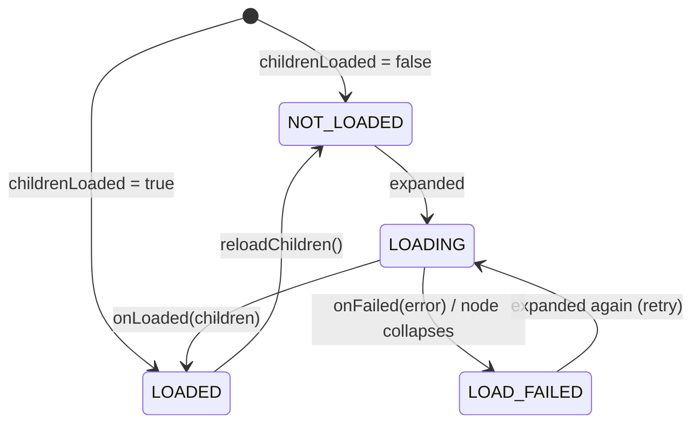

# TreeView

A tree view for Android built on a **single `RecyclerView`**. Rows have a fixed height, the
content width follows expansion and collapse, and the list scrolls both vertically and
horizontally without nesting scroll containers. Nodes are generic: the same library displays
file systems, organization charts, comment threads or any other hierarchy.

```
treeview
├── TreeNode<T>              the data model: value, parent/children, expansion and load state
├── TreeAdapter<T, VH>       flattens the tree into rows; expand, collapse, insert, remove, load
├── TreeLayoutManager        fixed-height rows, two-axis scrolling, content width, axis lock
├── RowWidthCalculator<T>    optional: row width without measuring views (exact scroll range)
├── ChildLoader<T>           optional: loads children lazily on first expansion
├── ContentWidthProvider     link between adapter and layout manager (implemented by TreeAdapter)
└── OnNodeClickListener<T> / OnNodeLongClickListener<T>
```

## Features

- Vertical **and** horizontal scrolling inside one RecyclerView, with an optional
  **per-gesture axis lock** (a drag and its fling move along one axis only).
- **Exact horizontal scroll range** that grows and shrinks as nodes are expanded and collapsed.
- **Fine-grained change notifications**: expanding or collapsing inserts or removes exactly
  the affected rows, so item animations work and untouched rows are kept.
- **Lazy loading** of children with loading / failed states, retry and refresh.
- **Single-child chain expansion** (`x › github › module › treeview` opens in one tap).
- **Click and long-click** listeners per row.
- Generic nodes, Kotlin DSL for building trees, Java-friendly API (`@JvmOverloads`,
  `fun interface`s), Kotlin explicit API mode.

## Requirements

- minSdk 21
- `androidx.recyclerview:recyclerview` 1.4.0 (exposed as an `api` dependency)

## Installation

Include the module in your build and depend on it:

```kotlin
// settings.gradle.kts
include(":treeview")

// app/build.gradle.kts
dependencies {
    implementation(project(":treeview"))
}
```

## Usage

The example below shows a file browser that loads directories lazily from disk.

### 1. Model and row layout

```kotlin
data class FileItem(
    val file: File,
    val isDirectory: Boolean = file.isDirectory,
) {
    val name: String get() = file.name
}
```

```xml
<!-- res/layout/item_file.xml: a fixed-height row; the indentation is set in code. -->
<LinearLayout xmlns:android="http://schemas.android.com/apk/res/android"
    android:layout_width="wrap_content"
    android:layout_height="40dp"
    android:gravity="center_vertical"
    android:orientation="horizontal"
    android:paddingEnd="12dp">

    <TextView
        android:id="@+id/arrow"
        android:layout_width="24dp"
        android:layout_height="wrap_content"
        android:gravity="center" />

    <TextView
        android:id="@+id/icon"
        android:layout_width="24dp"
        android:layout_height="wrap_content"
        android:gravity="center" />

    <TextView
        android:id="@+id/name"
        android:layout_width="wrap_content"
        android:layout_height="wrap_content"
        android:layout_marginStart="8dp"
        android:maxLines="1"
        android:textSize="15sp" />
</LinearLayout>
```

### 2. Adapter

Subclass `TreeAdapter`, implement `onCreateNodeViewHolder` and `onBindNode`. Don't set click
listeners on the item view; the adapter installs them.

```kotlin
class FileAdapter(
    private val indentPx: Int,
) : TreeAdapter<FileItem, FileAdapter.ViewHolder>() {

    override fun onCreateNodeViewHolder(parent: ViewGroup, viewType: Int): ViewHolder =
        ViewHolder(LayoutInflater.from(parent.context).inflate(R.layout.item_file, parent, false))

    override fun onBindNode(holder: ViewHolder, node: TreeNode<FileItem>, payloads: List<Any>) {
        // PAYLOAD_EXPANSION_CHANGED: only the indicator (expansion or load state) changed.
        val indicatorOnly = payloads.isNotEmpty() &&
            payloads.all { it === TreeAdapter.PAYLOAD_EXPANSION_CHANGED }
        if (!indicatorOnly) {
            holder.itemView.setPaddingRelative(node.depth * indentPx, 0, 0, 0)
            holder.name.text = node.value.name
        }
        holder.arrow.text = when {
            node.loadState == TreeNode.LoadState.LOADING -> "…"
            !isExpandable(node) -> ""
            node.isExpanded -> "▼"
            else -> "▶"
        }
        holder.icon.text = if (node.value.isDirectory) "📁" else "📄"
        holder.icon.alpha = if (node.isKnownEmpty && node.value.isDirectory) 0.4f else 1f
    }

    class ViewHolder(view: View) : RecyclerView.ViewHolder(view) {
        val arrow: TextView = view.findViewById(R.id.arrow)
        val icon: TextView = view.findViewById(R.id.icon)
        val name: TextView = view.findViewById(R.id.name)
    }
}
```

### 3. Lazy loading

A `ChildLoader` is called the first time a node with unknown children is expanded. It may
report back from any thread.

```kotlin
class FileSystemLoader(private val executor: Executor) : ChildLoader<FileItem> {

    override fun loadChildren(node: TreeNode<FileItem>, callback: ChildLoadCallback<FileItem>) {
        executor.execute {
            try {
                val files = node.value.file.listFiles()
                    ?: throw IOException("Cannot list ${node.value.file}")
                val children = files
                    .sortedWith(compareBy<File>({ !it.isDirectory }, { it.name.lowercase() }))
                    // Directories are lazy themselves; files have no children to load.
                    .map { TreeNode(FileItem(it), childrenLoaded = !it.isDirectory) }
                callback.onLoaded(children)
            } catch (e: Exception) {
                callback.onFailed(e)
            }
        }
    }
}
```

### 4. Wiring it up

```xml
<!-- The RecyclerView needs an exact size: match_parent or a fixed dimension. -->
<androidx.recyclerview.widget.RecyclerView
    android:id="@+id/tree"
    android:layout_width="match_parent"
    android:layout_height="match_parent"
    android:scrollbars="vertical|horizontal" />
```

```kotlin
val density = resources.displayMetrics.density
val indentPx = (20 * density).toInt()
val rowHeightPx = (40 * density).toInt()
val fixedPartsPx = ((24 + 24 + 8 + 12) * density).toInt() // arrow + icon + margin + paddingEnd
val labelPaint = TextPaint(Paint.ANTI_ALIAS_FLAG).apply {
    textSize = TypedValue.applyDimension(TypedValue.COMPLEX_UNIT_SP, 15f, resources.displayMetrics)
}

val adapter = FileAdapter(indentPx).apply {
    // Exact horizontal scroll range, computed without inflating views.
    rowWidthCalculator = RowWidthCalculator { node ->
        node.depth * indentPx + fixedPartsPx + ceil(labelPaint.measureText(node.value.name)).toInt()
    }
    childLoader = FileSystemLoader(Executors.newSingleThreadExecutor())
    autoExpandSingleChild = true

    onNodeClickListener = OnNodeClickListener<FileItem> { node, _, _ ->
        if (!node.value.isDirectory) openFile(node.value.file)
        // Directories toggle automatically afterwards (toggleOnClick = true).
    }
    onNodeLongClickListener = OnNodeLongClickListener<FileItem> { node, _, view ->
        showContextMenu(node, view)
        true
    }
    onChildrenLoadFailed = { node, _ ->
        Toast.makeText(recyclerView.context, "Cannot open ${node.value.name}", Toast.LENGTH_SHORT).show()
    }

    // An expanded lazy root starts loading as soon as it is set.
    setRoots(listOf(TreeNode(FileItem(rootDirectory), isExpanded = true, childrenLoaded = false)))
}

recyclerView.layoutManager = TreeLayoutManager(rowHeight = rowHeightPx)
recyclerView.adapter = adapter
```

### 5. Changing the tree

Once a tree is displayed, change it through the adapter so RecyclerView is notified:

```kotlin
adapter.expand(node)                    // also: collapse, toggle, toggleAt(position)
adapter.insertNode(parent, TreeNode(FileItem(newDir)), index = 0)
adapter.removeNode(node)                // removes the whole subtree
adapter.reloadChildren(directoryNode)   // drop children and load them again
node.value = renamedItem
adapter.notifyNodeChanged(node)         // rebind and recompute its row width

val position = adapter.reveal(deepNode) // expand all ancestors
recyclerView.scrollToPosition(position)
```

Static trees can be built with the DSL and need no loader:

```kotlin
val root = treeNode(Department("Headquarters"), isExpanded = true) {
    child(Department("R&D")) {
        child(Department("Mobile"))
        child(Department("Backend"))
    }
    child(Department("Marketing"))
}
```

## Design

### Data model: `TreeNode`

A node holds a `value`, its `parent` and `children`, `isExpanded` and a `loadState`. Nodes
are compared by identity, never by value, so two nodes may hold equal values. The `depth` is
cached and updated whenever a node is attached or detached, because the adapter compares
depths in tight loops.

`TreeNode`'s structural methods (`addChild`, `insertChild`, `removeChild`) only change the data
and notify nobody; they are meant for building a tree before it is handed to the adapter. For
the same reason `isExpanded` and `loadState` are read-only outside the library: once a tree is
displayed, every change goes through `TreeAdapter`.

### Flattened projection: `TreeAdapter`

RecyclerView shows a flat list, so the adapter keeps two structures:

- `roots` — the top-level nodes;
- `visibleNodes` — a pre-order traversal containing only nodes whose ancestors are all
  expanded. The adapter position of a node is its index in this list.

```
x ▼                     visibleNodes[0]
├── github ▼            visibleNodes[1]
│   └── module ▶        visibleNodes[2]   (children hidden: not in the list)
└── README.md           visibleNodes[3]
```

Because the visible descendants of a node always form a contiguous block right after it
(the rows deeper than the node), collapsing is a range removal and expanding is a range
insertion. Each operation edits `visibleNodes` in place and dispatches the narrowest
notification: `notifyItemRangeInserted` / `notifyItemRangeRemoved` for the subtree, plus
`notifyItemChanged(position, PAYLOAD_EXPANSION_CHANGED)` for the node whose indicator changed.
Partial rebinds with that payload let `onBindNode` update only the indicator.

Expand, collapse, insert and remove are O(visible rows) in the worst case (list shifting and
position lookup). `toggleAt(position)` skips the lookup and is preferred in click handlers.

### Expandability

`isExpandable(node)` decides whether a row shows an indicator and reacts to expansion. The
default is *has children, or its children aren't loaded yet*. It is open, so other rules are
possible, for example making empty directories expandable:

```kotlin
override fun isExpandable(node: TreeNode<FileItem>) =
    super.isExpandable(node) || node.value.isDirectory
```

`node.isKnownEmpty` (loaded, no children) lets the UI show empty nodes differently.

### Lazy loading



- **Request identity.** Every load is represented by a request object that the node stores as
  the one it waits for. A result is applied only if it belongs to that request, so results
  for nodes that were removed, reloaded or replaced by `setRoots` are dropped silently, and a
  callback can never be applied twice.
- **Thread hop.** `ChildLoadCallback` may be called from any thread; results are posted to
  the main thread before they touch the adapter.
- **Deferred start.** Loads requested during an operation are queued and started only when the
  adapter state is consistent again. A loader that answers synchronously therefore re-enters
  a valid adapter, and loads requested by that nested result are picked up by the same loop.
- **Collapse while loading** doesn't cancel the request: the children are added but stay
  hidden until the node is expanded again.
- A node that turns out to be empty and isn't expandable is collapsed again; a failed node is
  collapsed so that the next expansion retries.

### Single-child chains

With `autoExpandSingleChild`, expanding a node keeps walking down while the current node has
exactly one child that is expandable, not known to be empty and accepted by the protected hook
`canAutoExpand(child)`. All states along the chain are updated first and the rows are inserted
with **one** notification, so the chain animates as a single change. If the walk reaches a
node whose children aren't loaded, that node is loaded and the walk resumes when the result
arrives. Collapsing is unaffected, and `reveal()` never chain-expands.

### Layout: `TreeLayoutManager`

**Coordinate model.** The scroll position is two absolute offsets, `verticalOffset` and
`horizontalOffset`. With a fixed row height the visible row range is simply
`verticalOffset / rowHeight … (verticalOffset + viewportHeight) / rowHeight`, so layout costs
O(visible rows), large scroll deltas (fast flings) never leave gaps, and jumping to any
position is O(1). Horizontal scrolling never changes which rows are visible; it only translates
the attached children.

**Recycling.** On vertical scroll the layout manager shifts the children, recycles rows that
left the visible range and adds rows that entered it, keeping attached children contiguous and
sorted by position. Rows that were only shifted are neither re-measured nor re-laid out.

**Content width.** The horizontal scroll range is the width of the widest row. It comes from
two sources, and the larger one wins, so an underestimate never clips a row:

1. a `ContentWidthProvider` — `contentWidthProvider` if set, otherwise the adapter if it
   implements the interface. `TreeAdapter` does: with a `RowWidthCalculator` it reports the
   exact widest visible row;
2. the natural width of the rows measured so far. This value is reset when the structure
   changes (expand, collapse, insert, remove) and only grows while scrolling, so vertical
   scrolling never makes the horizontal position jump.

When the content becomes narrower (e.g. after a collapse) and the view is scrolled to the
right, the horizontal offset is pulled back into range.

**Row width cache.** The adapter caches each row's width on its node together with a
generation stamp. `invalidateRowWidths()` just increments the stamp (O(1)); a node's own
cache is dropped by `notifyNodeChanged` or when its depth changes. The maximum is updated
incrementally when rows are added and recomputed lazily, once, after rows were removed.

**Row measurement.** Each row is first measured with an `UNSPECIFIED` width to get its natural
width. With `stretchRowWidth` (default) rows are then measured with an exact width of
`max(contentWidth, viewportWidth)`, so backgrounds and dividers span the whole scrollable area.
Rows are re-measured only when that target width changes.

**Axis lock.** RecyclerView asks `canScrollHorizontally()` / `canScrollVertically()` for every
touch event and again when it computes the fling velocity. The layout manager observes touch
events through a non-intercepting `OnItemTouchListener`, which RecyclerView calls *before* it
handles each event. As soon as the finger has moved beyond the touch slop, the dominant axis is
locked and the other `canScroll…()` returns `false`, which suppresses both dragging and flinging
along it, without subclassing RecyclerView. The lock is released after the gesture, so
programmatic scrolling stays unrestricted.

**Other behavior.** `scrollToPosition` scrolls the minimum distance needed to show the row
(like `LinearLayoutManager`); `scrollToPositionWithOffset` aligns it to the top;
`smoothScrollToPosition` scrolls vertically only and keeps the horizontal position. Both offsets
are saved and restored with the instance state.

### Clicks

`TreeAdapter.onCreateViewHolder` is final: it calls `onCreateNodeViewHolder` and installs click
and long-click listeners on the item view once per view holder. The node is resolved from
`bindingAdapterPosition` when the event happens, because holders are rebound and rows move as
the tree changes. A click notifies `onNodeClickListener` first and then, with `toggleOnClick`,
toggles the row — but only if the row still shows the same node, in case the listener changed
the tree. Rows are long-clickable only while `onNodeLongClickListener` is set, so accessibility
services don't announce a long-press action that does nothing.

### Threading

All adapter and layout manager methods must be called on the main thread. The only exception
is `ChildLoadCallback`, which may be called from any thread.

## API overview

| Type | Key members |
|---|---|
| `TreeNode<T>` | `value`, `children`, `parent`, `depth`, `isExpanded`, `loadState`, `isLeaf`, `isKnownEmpty`, `root`, `addChild`, `insertChild`, `removeChild`, `child { }`, `ancestors()`, `descendants()`, `isDescendantOf()`, top-level `treeNode { }` |
| `TreeAdapter<T, VH>` | `onCreateNodeViewHolder`, `onBindNode`, `isExpandable`, `canAutoExpand` (protected), `setRoots`, `expand`, `collapse`, `toggle`, `toggleAt`, `expandAll`, `collapseAll`, `reveal`, `insertNode`, `removeNode`, `reloadChildren`, `notifyNodeChanged`, `invalidateRowWidths`, `getNode`, `getNodeOrNull`, `positionOf`, `contains`, `isDisplayed`, `rootNodes`, `maxRowWidth`, `PAYLOAD_EXPANSION_CHANGED` |
| `TreeAdapter` properties | `rowWidthCalculator`, `childLoader`, `autoExpandSingleChild`, `toggleOnClick`, `onNodeClickListener`, `onNodeLongClickListener`, `onNodeExpansionChanged`, `onChildrenLoadFailed` |
| `TreeLayoutManager` | `rowHeight`, `contentWidthProvider`, `stretchRowWidth`, `isAxisLockEnabled`, `contentWidth`, `invalidateContentWidth`, `findFirstVisibleItemPosition`, `findLastVisibleItemPosition`, `scrollToPositionWithOffset` |
| Interfaces | `RowWidthCalculator<T>`, `ChildLoader<T>`, `ChildLoadCallback<T>`, `ContentWidthProvider`, `OnNodeClickListener<T>`, `OnNodeLongClickListener<T>` |

## Limitations

- The RecyclerView must have an exact size; auto-measure (`wrap_content`) isn't supported.
- All rows share one height (`rowHeight`, including decoration insets and margins). If it is
  `<= 0`, the first item is measured once.
- Right-to-left layouts aren't supported; rows always start at the left edge.
- Predictive item animations aren't supported; regular add, remove and move animations run.
- `expandAll()` expands only nodes whose children are loaded; it doesn't trigger lazy loading.

## License

```
Copyright © 2026 Github Lzhiyong

Licensed under the Apache License, Version 2.0 (the "License");
you may not use this file except in compliance with the License.
You may obtain a copy of the License at

     http://www.apache.org/licenses/LICENSE-2.0

Unless required by applicable law or agreed to in writing, software
distributed under the License is distributed on an "AS IS" BASIS,
WITHOUT WARRANTIES OR CONDITIONS OF ANY KIND, either express or implied.
See the License for the specific language governing permissions and
limitations under the License.
```
